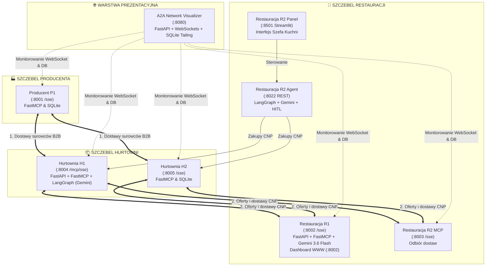
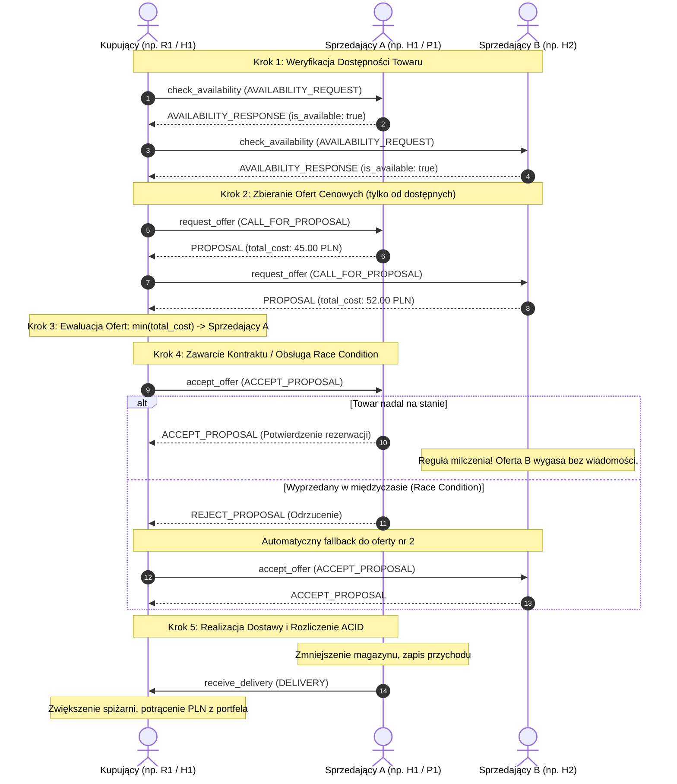

# 🌐 Ekosystem Wieloagentowego Łańcucha Dostaw A2A (Supply Chain & E-Commerce)

> **Status projektu:** Ukończony (Completed & Verified)  
> **Standard komunikacji:** Model Context Protocol (MCP, transport SSE)  
> **Protokół negocjacji:** Contract Net Protocol (CNP)  
> **Silnik inteligencji:** Google Gemini (Gemini 3.6 Flash / Gemini 3.1 Flash-Lite) + LangChain / LangGraph  
> **Architektura danych:** Rozproszone bazy SQLite z transakcjami atomowymi (ACID) i trybem WAL  

---

## 📋 Spis Treści
- [Wprowadzenie i Cel Projektu](#-wprowadzenie-i-cel-projektu)
- [Architektura Systemu i Rola Węzłów](#-architektura-systemu-i-rola-węzłów)
- [Wykaz Węzłów, Portów i Usług](#-wykaz-węzłów-portów-i-usług)
- [Standard Protokołu Handlowego (CNP over MCP)](#-standard-protokołu-handlowego-cnp-over-mcp)
- [Kluczowe Zasady i Wzorce Biznesowe](#-kluczowe-zasady-i-wzorce-biznesowe)
- [Szczegółowy Opis Modułów Ekosystemu](#-szczegółowy-opis-modułów-ekosystemu)
- [Interaktywne Panele i Demonstrator WWW](#-interaktywne-panele-i-demonstrator-www)
- [Wymagania i Konfiguracja Środowiska](#-wymagania-i-konfiguracja-środowiska)
- [Uruchomienie Ekosystemu](#-uruchomienie-ekosystemu)
- [Testy Automatyczne](#-testy-automatyczne)
- [Struktura Repozytorium](#-struktura-repozytorium)
- [Rozwiązywanie Problemów (FAQ & Troubleshooting)](#-rozwiązywanie-problemów-faq--troubleshooting)

---

## 💡 Wprowadzenie i Cel Projektu

Projekt **A2A E-Commerce** to w pełni autonomiczny, wieloagentowy ekosystem łańcucha dostaw dla gastronomii włoskiej (**Producent** ➔ **Hurtownie** ➔ **Restauracje**), połączony z dedykowaną **nakładką wizualizatora sieci**.

Węzły ekosystemu współpracują bez udziału człowieka, realizując autonomiczne decyzje zakupowe, badanie rynku, negocjacje cenowe, wybór najkorzystniejszych ofert, obsługę wyczerpania zapasów (race condition) oraz automatyczne rozliczenia finansowe i księgowanie dostaw.

Komunikacja między węzłami opiera się na otwartym standardzie **Model Context Protocol (MCP)** z transportem **Server-Sent Events (SSE)**, natomiast interakcje przetargowe realizują formalny standard **Contract Net Protocol (CNP)**.

---

## 🏗️ Architektura Systemu i Rola Węzłów

Hierarchia podaży i popytu jest zorganizowana w trzystopniowy łańcuch dostaw z dodatkowym węzłem wizualizacyjnym:



### Role i Odpowiedzialności Węzłów:
1. **Producent (`P1`):** Występuje **wyłącznie w roli Sprzedawcy**. Wytwarza 11 podstawowych surowców (mąka, passata, sery, wędliny, zioła), zarządza katalogiem fabrycznym, stosuje rabaty hurtowe i po zawarciu kontraktu automatycznie wywołuje dostawę na serwer hurtowni.
2. **Hurtownie (`H1`, `H2`):** Pełnią **podwójną rolę**:
   - **Sprzedawcy** wobec Restauracji (konkurują cenowo w przetargach CNP).
   - **Kupującego** wobec Producenta (uzupełniają zapasy magazynowe, gdy stan spadnie poniżej progu bezpieczeństwa).
   - *H1* posiada wbudowanego autonomicznego agenta z audytem w tle co 3 minuty.
3. **Restauracje (`R1`, `R2`):** Występują w roli **Kupujących**.
   - Analizują receptury dań (np. pizza margherita, capricciosa, diavola), zużywają składniki podczas gotowania (`/cook`), wykrywają deficyty spiżarni i uruchamiają procedury przetargowe w hurtowniach.
   - *R1* podejmuje decyzje automatycznie w oparciu o regułę najniższej ceny $\min(\text{total\_cost})$.
   - *R2* wspiera tryb **Human-in-the-Loop (HITL)** z autoryzacją zakupu przez człowieka w panelu Streamlit.
4. **Wizualizator Sieci (`Overlay`):** Prezentuje architekturę sieci, 5-krokowy stepper CNP, inspekcję pakietów JSON, narrację biznesową, salda portfeli oraz dynamiczne aktualizacje baz danych w czasie rzeczywistym.

---

## 🔌 Wykaz Węzłów, Portów i Usług

Poniższa tabela stanowi kompletne i zweryfikowane zestawienie wszystkich punktów styku w ekosystemie:

| Węzeł | Rola | Port | Protokół / Ścieżka SSE | Dashboard / UI | API Docs (Swagger) |
|---|---|:---:|---|---|:---:|
| **P1 (Producent)** | Sprzedawca B2B | `8001` | `http://localhost:8001/sse` | Tester GUI (opcjonalny) | — |
| **H1 (Hurtownia 1)** | Sprzedawca / Kupujący | `8004` | `http://127.0.0.1:8004/mcp/sse` | — | `http://127.0.0.1:8004/docs` |
| **H2 (Hurtownia 2)** | Sprzedawca / Kupujący | `8005` | `http://localhost:8005/sse` | — | — |
| **R1 (Restauracja 1)** | Kupujący | `8002` | `http://localhost:8002/sse` | `http://localhost:8002/` | `http://localhost:8002/docs` |
| **R2 MCP (Restauracja 2)** | Odbiór dostaw | `8003` | `http://localhost:8003/sse` | — | — |
| **R2 Agent (Restauracja 2)** | Mózg LangGraph | `8022` | REST: `/chat`, `/powiadomienia` | — | `http://localhost:8022/docs` |
| **R2 GUI (Restauracja 2)** | Panel Szefa Kuchni | `8501` | Interfejs Streamlit | `http://localhost:8501` | — |
| **Overlay (Wizualizator)** | Monitor & Demonstrator | `8080` | FastAPI + WebSockets | `http://localhost:8080` | `http://localhost:8080/docs` |

> [!IMPORTANT]
> Zwróć uwagę na ścieżkę SSE dla **H1**: Serwer H1 montuje aplikację FastMCP pod prefiksem `/mcp`, stąd adres to `http://127.0.0.1:8004/mcp/sse` (w pozostałych węzłach jest to standardowe `/sse`).

---

## 🔄 Standard Protokołu Handlowego (CNP over MCP)

Wszystkie interakcje kupna i sprzedaży podlegają ścisłemu 5-etapowemu standardowi przetargowemu:



### Zestawienie Narzędzi MCP i Schematów Danych:

| Krok | Rola Węzła | Narzędzie MCP | Format Wejściowy | Format Odpowiedzi |
|:---:|---|---|---|---|
| **1** | Sprzedający | `check_availability` | `availability-request.json` | `availability-response.json` |
| **2** | Sprzedający | `request_offer` | `request-offer.json` | `response-offer.json` |
| **3** | Kupujący | *Wewnętrzna ewaluacja* | Porównanie `PROPOSAL` | $\min(\text{total\_cost})$ + walidacja portfela |
| **4** | Sprzedający | `accept_offer` | `accept-offer.json` | Potwierdzenie lub `reject.json` |
| **5** | Kupujący | `receive_delivery` | `delivery.json` | Potwierdzenie przyjęcia i zaksięgowania |

Wszystkie definicje schematów JSON znajdują się w katalogu `docs/schemas/json-schemas/`.

---

## 🛡️ Kluczowe Zasady i Wzorce Biznesowe

1. **Zasada Milczenia (Silence Protocol):**  
   Po wyłonieniu zwycięzcy przetargu Kupujący wysyła komunikat `accept_offer` **wyłącznie** do wygranego sprzedawcy. Do pozostałych oferentów nie są wysyłane żadne wiadomości rezygnacji – ich propozycje cenowe milcząco wygasają, co drastycznie ogranicza ruch sieciowy.
2. **Obsługa Race Condition i Automatyczny Fallback:**  
   Gdy w czasie pomiędzy wygenerowaniem oferty a jej akceptacją towar zostanie wykupiony przez innego kupującego, sprzedawca zwraca `REJECT_PROPOSAL`. Kupujący nie rzuca wyjątku, lecz automatycznie przechodzi do kolejnej najtańszej oferty z listy (Fallback Step).
3. **Ścisła Separacja Uprawnień (Tajemnica Handlowa):**  
   Publiczne serwery MCP wystawiają jedynie punkty styku protokołu handlowego (`check_availability`, `request_offer`, `accept_offer`, `receive_delivery`). Dane o stanie budżetu (`wallet`), zawartości spiżarni i algorytmach decyzyjnych są dostępne wyłącznie dla lokalnego agenta LLM i nie są transmitowane przez sieć.
4. **Transakcyjność ACID w Bazach Danych:**  
   Każda transakcja kupna/sprzedaży bilansuje magazyn i konto finansowe w atomowych transakcjach SQL. W razie błędu sieciowego następuje natychmiastowy `ROLLBACK`.
5. **Nadzór Human-in-the-Loop (HITL):**  
   Agent Restauracji R2 posiada wbudowany punkt decyzyjny – po zebraniu ofert wstrzymuje automatyczny zakup i prosi człowieka o autoryzację transakcji w panelu Streamlit lub przez API.

---

## 📦 Szczegółowy Opis Modułów Ekosystemu

### 🏭 Producent (`producer/`)
- **Silnik:** FastMCP na porcie `8001` (SSE).
- **Charakter:** 100% deterministyczny (bez LLM), oparty na twardej logice relacyjnej.
- **Katalog:** 11 certyfikowanych surowców (mąka, passata, mozzarella, burrata, parmezan, szynki, rukola, salami itp.).
- **Funkcje B2B:** Automatyczne rabaty hurtowe (np. 10% rabatu dla stałego partnera H1) oraz automatyczne nawiązanie połączenia zwrotnego po akceptacji oferty w celu dostarczenia towaru (`receive_delivery`).

### 📦 Hurtownia 1 (`warehouse-1/`)
- **Silnik:** FastAPI + FastMCP (`/mcp/sse`) na porcie `8004`.
- **Inteligencja:** LangChain / LangGraph z modelem Google Gemini.
- **Audyt w tle:** Co 3 minuty wykonuje autonomiczny przegląd stanów magazynowych w bazie SQLite (`warehouse1.db`). W przypadku spadku poniżej `min_threshold` samodzielnie zamawia surowce u Producenta P1.

### 📦 Hurtownia 2 (`warehouse-2/`)
- **Silnik:** FastMCP na porcie `8005` (SSE).
- **Baza danych:** SQLite (`warehouse2.db`) z pełną ewidencją transakcji i portfelem `wallet_warehouse2`.
- **Działanie:** Konkurencyjny dostawca dla restauracji R1 i R2, realizujący sprzedaż i zakupy w pełnym reżimie atomowości.

### 🍕 Restauracja 1 (`restaurant-1/`)
- **Silnik:** Zintegrowany węzeł FastAPI i FastMCP na porcie `8002`.
- **Inteligencja:** Google Gemini 3.6 Flash (z fallbackiem na Gemini 3.1 Flash-Lite) oraz zestaw narzędzi narzędziowych SQL (`GEMINI_TOOLS`).
- **Kuchnia i Menu:** Obsługuje zamówienia dań włoskich (`POST /cook`). Zmniejsza stany surowców i w razie naruszenia progów minimalnych autonomicznie przeprowadza przetarg w hurtowniach H1 i H2.
- **Interfejsy:** Panel WWW w przeglądarce (`/`), Swagger UI (`/docs`), interfejs poleceń naturalnych (`POST /chat`), pełny stan JSON (`GET /status`).

### 🍕 Restauracja 2 (`restaurant-2/`)
- **Architektura mikrousług:**
  - **Serwer MCP (`network/server.py`):** Nasłuchuje na porcie `8003` i przyjmuje dostawy surowców (`receive_delivery`).
  - **Agent API (`Projekt_A2A.py`):** Port `8022`, silnik LangGraph + Gemini, monitor magazynu w tle, kolejka zadań kuchennych.
  - **Panel GUI (`gui.py`):** Interaktywna aplikacja Streamlit na porcie `8501`.
- **Funkcje specjalne:** Tryb Human-in-the-Loop (autoryzacja transakcji przez człowieka), mechanizm zapobiegania halucynacjom ("Zasada braku domysłów") oraz automatyczny reset pamięci wątku (`[ZADANIE_ZAKONCZONE]`).

### 🌐 Nakładka Wizualizatora (`overlay/`)
- **Silnik:** FastAPI, Uvicorn, WebSockets na porcie `8080`.
- **Zadanie:** Demonstracja i wizualizacja przepływu handlu w czasie rzeczywistym.
- **Możliwości:**
  - 4 predefiniowane scenariusze pokazowe (Standardowy cykl CNP, Race Condition & Fallback, B2B Producent -> Hurtownia, Decyzja Human-in-the-Loop).
  - Interaktywny 5-stopniowy stepper CNP.
  - Inspektor pakietów JSON zgodny z oficjalnymi schematami.
  - Podgląd na żywo sald portfeli i stanów magazynowych wszystkich węzłów (z efektem podświetlenia *flash update* przy transakcjach).

---

## 🖥️ Interaktywne Panele i Demonstrator WWW

Po uruchomieniu systemu w przeglądarce dostępne są następujące interfejsy:

| Interfejs | Adres URL | Przeznaczenie |
|---|---|---|
| **Wizualizator Sieci A2A** | [`http://localhost:8080`](http://localhost:8080) | Główny panel prezentacyjny, stepper CNP, graf agentów, scenariusze demonstracyjne |
| **Panel Restauracji R1** | [`http://localhost:8002`](http://localhost:8002) | Wizualny dashboard spiżarni, stan kasy, wyzwalanie zamówień kuchennych |
| **Panel Restauracji R2 (Streamlit)** | [`http://localhost:8501`](http://localhost:8501) | Pulpit Szefa Kuchni, autoryzacja zakupów (HITL), logi systemowe |
| **Swagger API Restauracji R1** | [`http://localhost:8002/docs`](http://localhost:8002/docs) | Interaktywna dokumentacja REST API i endpoint sterowania `/chat` |
| **Swagger API Hurtowni H1** | [`http://127.0.0.1:8004/docs`](http://127.0.0.1:8004/docs) | Interaktywna dokumentacja REST API hurtowni H1 |
| **Swagger API Agenta R2** | [`http://127.0.0.1:8022/docs`](http://127.0.0.1:8022/docs) | Endpointy sterujące agenta R2 (`/chat`, `/powiadomienia`) |

---

## ⚙️ Wymagania i Konfiguracja Środowiska

### Wymagania Techniczne
- **System Operacyjny:** Windows 10/11, Linux lub macOS
- **Wersja Pythona:** **Python 3.12** *(zalecana i w pełni przetestowana)*
- **Klucz API:** [Google AI Studio API Key](https://aistudio.google.com/apikey) dla modeli Gemini

> [!WARNING]
> **Dlaczego Python 3.12 i przypięcie wersji?**
> - Biblioteka **`mcp`** wymaga wersji `<2.0.0` (wersja 2.x wprowadza breaking changes w obsłudze wyjątków).
> - Biblioteka **`fastmcp`** wymaga wersji `<3.0.0`.
> - Biblioteka **`langchain-google-genai`** wymaga wersji `<4.0.0` (wersja 4.x wymusza migrację na inny SDK `google-genai`).
> - Nie instaluj ręcznie pakietów `google-generativeai` ani `google-ai-generativelanguage` z sztywnymi wersjami – pakiety te są automatycznie rozwiązywane przez `langchain-google-genai`.

---

### Instrukcja Konfiguracji Krok po Kroku

#### 1. Klonowanie repozytorium
```bash
git clone https://github.com/nowikarol/a2a-ecommerce.git
cd a2a-ecommerce
```

#### 2. Utworzenie środowiska wirtualnego (venv)
```cmd
py -3.12 -m venv venv
```

#### 3. Aktywacja środowiska
- **W systemie Windows (cmd.exe):**
  ```cmd
  venv\Scripts\activate
  ```
- **W systemie Windows (PowerShell):**
  ```powershell
  .\venv\Scripts\Activate.ps1
  ```
  *(Jeśli PowerShell zablokuje wykonanie skryptu, wykonaj uprzednio: `Set-ExecutionPolicy -Scope Process -ExecutionPolicy Bypass`)*
- **W systemie Linux / macOS:**
  ```bash
  source venv/bin/activate
  ```

#### 4. Instalacja zależności
```bash
pip install -r requirements.txt
```

#### 5. Konfiguracja zmiennych środowiskowych (`.env`)
Utwórz plik `.env` w katalogu głównym projektu (oraz upewnij się, że moduły posiadają dostęp do klucza):
```env
GOOGLE_API_KEY=twoj_prywatny_klucz_z_google_ai_studio
```

---

## 🚀 Uruchomienie Ekosystemu

### ⚡ Metoda 1: Uruchomienie Automatyczne (Zalecana dla Windows)

W głównym katalogu projektu znajduje się skrypt wsadowy, który weryfikuje wirtualne środowisko i otwiera 8 dedykowanych okien konsoli dla wszystkich serwisów:

```cmd
start_all.bat
```

Skrypt uruchamia kolejno:
1. `P1`: Producent (`:8001`)
2. `H1`: Hurtownia 1 (`:8004`)
3. `H2`: Hurtownia 2 (`:8005`)
4. `R1`: Restauracja 1 API & Web (`:8002`)
5. `R2`: Serwer MCP Restauracji 2 (`:8003`)
6. `R2`: Agent LangGraph Restauracji 2 (`:8022`)
7. `R2`: Panel Streamlit Restauracji 2 (`:8501`)
8. `Overlay`: Nakładka Wizualizatora WWW (`:8080`)

### 🛑 Bezpieczne Zatrzymanie Wszystkich Serwisów
Aby natychmiast zakończyć działanie procesów i zwolnić wszystkie porty (8001, 8002, 8003, 8004, 8005, 8022, 8080, 8501):

```cmd
stop_all.bat
```

---

### 🛠️ Metoda 2: Uruchomienie Manualne (Krok po Kroku)

Jeśli pracujesz na systemie Linux/macOS lub chcesz uruchomić poszczególne moduły w osobnych terminalach:

```bash
# Terminal 1 — Producent P1
cd producer && python MCP_server.py

# Terminal 2 — Hurtownia H1
cd warehouse-1 && python main.py

# Terminal 3 — Hurtownia H2
cd warehouse-2 && python server.py

# Terminal 4 — Restauracja R1
cd restaurant-1 && python main.py

# Terminal 5 — Restauracja R2 (Serwer MCP)
cd restaurant-2 && python -m network.server

# Terminal 6 — Restauracja R2 (Agent LangGraph API)
cd restaurant-2 && python Projekt_A2A.py

# Terminal 7 — Restauracja R2 (Panel Streamlit)
cd restaurant-2 && python -m streamlit run gui.py

# Terminal 8 — Nakładka Wizualizatora
cd overlay && python -m uvicorn app:app --host 0.0.0.0 --port 8080
```

---

## 🧪 Testy Automatyczne

W projekcie zaimplementowano kompleksowy zestaw testów jednostkowych i integracyjnych weryfikujących poprawność protokołu CNP, transakcji SQL, bilansowania portfela oraz odporności na błędy:

```bash
pytest
```

Wszystkie testy wykonują się w izolacji bazodanowej i sprawdzają m.in.:
- Przestrzeganie schematów JSON (`availability-request`, `request-offer`, `accept-offer`, `delivery`, `reject`).
- Wybór najtańszej oferty $\min(\text{total\_cost})$.
- Prawidłowe zadziałanie procedury fallback przy otrzymaniu `REJECT_PROPOSAL`.
- Nienaruszalność bilansu konta finansowego i spiżarni przy transakcjach ACID.

---

## 📁 Struktura Repozytorium

```text
a2a-ecommerce/
├── docs/                       # Oficjalna specyfikacja protokołu i schematy JSON
│   ├── PROTOCOL_SPECIFICATION.md
│   └── schemas/json-schemas/   # Schematy JSON walidujące komunikaty CNP
│
├── producer/                   # Węzeł Producenta P1 (port 8001)
│   ├── MCP_server.py           # Serwer FastMCP (SSE)
│   ├── gui.py                  # Panel testerski Flask
│   ├── setup_db.py             # Inicjalizacja bazy surowców
│   └── producer.db             # Baza SQLite producenta
│
├── warehouse-1/                # Węzeł Hurtowni H1 (port 8004)
│   ├── agent/                  # Agent LangGraph z modelem Gemini
│   ├── data/                   # Modele Pydantic i operacje SQLite
│   ├── network/                # Serwer FastMCP (/mcp/sse) i klient P1
│   ├── main.py                 # Punkt startowy FastAPI i audyt w tle
│   └── data/warehouse1.db      # Baza SQLite hurtowni H1
│
├── warehouse-2/                # Węzeł Hurtowni H2 (port 8005)
│   ├── server.py               # Serwer FastMCP (port 8005)
│   ├── database.py             # Inicjalizacja bazy danych
│   └── warehouse2.db           # Baza SQLite hurtowni H2
│
├── restaurant-1/               # Węzeł Restauracji R1 (port 8002)
│   ├── agent/                  # Mózg Gemini 3.6 Flash i narzędzia biznesowe
│   ├── data/                   # Modele danych i baza SQLite (restaurant.db)
│   ├── network/                # Serwer MCP i asynchroniczny klient hurtowni
│   ├── templates/index.html    # Panel WWW sterowania restauracją
│   ├── tests/                  # Pakiet testów pytest
│   └── main.py                 # Zintegrowane REST API i serwer MCP SSE
│
├── restaurant-2/               # Węzeł Restauracji R2 (porty 8003, 8022, 8501)
│   ├── agent/                  # Konfiguracja LangChain i obsługa HITL
│   ├── network/                # Serwer MCP odbioru dostaw (:8003)
│   ├── data/                   # Baza SQLite restauracja_2.db w trybie WAL
│   ├── gui.py                  # Interfejs WWW Streamlit (:8501)
│   └── Projekt_A2A.py          # Główny punkt startowy Agenta FastAPI (:8022)
│
├── overlay/                    # Nakładka Wizualizatora Sieci (port 8080)
│   ├── static/                 # Frontend (HTML5, CSS3, JavaScript)
│   ├── app.py                  # Serwer FastAPI, WebSockets i silnik demonstracyjny
│   └── README.md               # Dokumentacja techniczna wizualizatora
│
├── start_all.bat               # Skrypt uruchamiający cały ekosystem (8 serwisów)
├── stop_all.bat                # Skrypt zatrzymujący wszystkie procesy i zwalniający porty
├── requirements.txt            # Zunifikowane zależności Pythona
├── pytest.ini                  # Konfiguracja środowiska testowego
└── README.md                   # Główna dokumentacja projektu
```

---

## ❓ Rozwiązywanie Problemów (FAQ & Troubleshooting)

### 1. Błąd: `Port already in use` (Port jest zajęty)
**Rozwiązanie:** Uruchom skrypt `stop_all.bat`, który automatycznie zidentyfikuje procesy zajmujące porty (8001, 8002, 8003, 8004, 8005, 8022, 8080, 8501) i bezpiecznie je zamknie.

### 2. Błąd: `google.api_core.exceptions.GoogleAPIError` lub brak odpowiedzi agenta LLM
**Rozwiązanie:** 
- Sprawdź, czy w pliku `.env` znajduje się poprawny klucz `GOOGLE_API_KEY`.
- Upewnij się, że klucz posiada uprawnienia do wywoływania modeli Gemini w Google AI Studio.
- Jeśli klucz nie jest skonfigurowany, węzeł R1 automatycznie przełącza się w bezpieczny tryb deterministyczny (obsługując bazowe zapytania o stan magazynu i portfela).

### 3. Błąd: `ResolutionImpossible` podczas `pip install`
**Rozwiązanie:** Upewnij się, że korzystasz z **Pythona 3.12** w aktywnym środowisku wirtualnym `(venv)`. Mieszanie wersji globalnych Pythona lub instalacja nowszych pakietów `mcp>=2.0.0` powoduje konflikt zależności.

### 4. Błąd: `Execution of scripts is disabled on this system` (PowerShell)
**Rozwiązanie:** W konsoli PowerShell wykonaj:
```powershell
Set-ExecutionPolicy -Scope Process -ExecutionPolicy Bypass
```
a następnie ponownie uruchom `.\venv\Scripts\Activate.ps1`.

---

<div align="center">
  <sub>Projekt zrealizowany w ramach architektury Agent-to-Agent (A2A) E-Commerce Supply Chain.</sub>
</div>