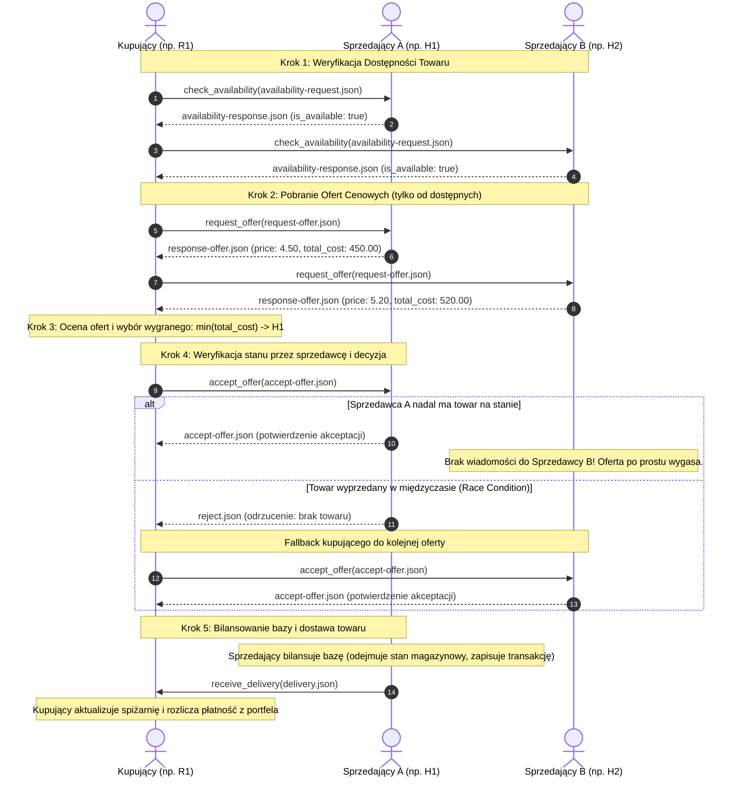

# Standard Protokołu Komunikacji Kupujący – Sprzedający (A2A E-Commerce)

Dokument stanowi oficjalną specyfikację techniczną protokołu handlowego w wieloagentowym łańcuchu dostaw (**Producent** ➔ **Hurtownie** ➔ **Restauracje**), opartego o **Model Context Protocol (MCP)** oraz **Contract Net Protocol (CNP)**.

Wszyscy członkowie zespołu implementujący poszczególne węzły (`producer`, `warehouse-1`, `warehouse-2`, `restaurant-1`, `restaurant-2`) są zobowiązani do przestrzegania niniejszego standardu narzędzi, formatów danych i przepływu interakcji.

---

## 👥 Rola Węzłów w Architekturze

W architekturze A2A rola kupującego i sprzedającego występuje rekurencyjnie na różnych szczeblach:
- **Restauracja (`R1`, `R2`):** Pełni rolę **Kupującego** wobec Hurtowni.
- **Hurtownia (`H1`, `H2`):** 
  - Pełni rolę **Sprzedającego** wobec Restauracji.
  - Pełni rolę **Kupującego** wobec Producenta.
- **Producent (`P1`):** Pełni rolę **Sprzedającego** wobec Hurtowni.

Z tego względu poniższy 5-etapowy standard protokołu dotyczy każdej relacji **Kupujący ➔ Sprzedający**.

---

## 🔄 5-Etapowy Przepływ Protokołu



---

## 🛠️ Zestawienie Narzędzi MCP i Sygnatur

### 1. Serwer Sprzedającego (Publiczny Serwer MCP Hurtowni / Producenta)

Sprzedający wystawia 3 standardowe narzędzia na swoim serwerze MCP:

| Krok | Sugerowana nazwa narzędzia | Dane wejściowe | Format odpowiedzi |
|---|---|---|---|
| **1** | `check_availability` | `availability-request.json` | `availability-response.json` |
| **2** | `request_offer` | `request-offer.json` | `response-offer.json` |
| **3 & 4** | `accept_offer` | `accept-offer.json` | `accept-offer.json` (sukces) LUB `reject.json` (brak towaru) |

---

### 2. Serwer Kupującego (Publiczny Serwer MCP Restauracji / Hurtowni)

Kupujący wystawia narzędzie do odbioru dostawy:

| Krok | Sugerowana nazwa narzędzia | Dane wejściowe |
|---|---|---|
| **5** | `receive_delivery` | `delivery.json` |

---

## 📋 Szczegółowy Opis Kroków i Schematy Danych

Wszystkie schematy bazują na plikach JSON znajdujących się w katalogu `docs/schemas/json-schemas/`.

### Krok 1: Sprawdzenie Dostępności Towaru (`availability-request` ➔ `availability-response`)
Kupujący odpytuje serwer sprzedającego o to, czy posiada wymaganą ilość towaru.

**Zapytanie (`docs/schemas/json-schemas/availability-request.json`):**
```json
{
  "sender_id": "R1",
  "receiver_id": "H1",
  "message_type": "AVAILABILITY_REQUEST",
  "item": {
    "name": "tomatoes",
    "quantity": 100
  }
}
```

**Odpowiedź (`docs/schemas/json-schemas/availability-response.json`):**
```json
{
  "sender_id": "H1",
  "receiver_id": "R1",
  "message_type": "AVAILABILITY_RESPONSE",
  "item": {
    "name": "tomatoes",
    "quantity": 100
  },
  "is_available": true,
  "available_quantity": 150
}
```
*Zasada:* Jeśli `is_available` jest `false`, kupujący **nie wysyła** do tego sprzedawcy zapytania ofertowego w Kroku 2.

---

### Krok 2: Pobranie Oferty Cenowej (`request-offer` ➔ `response-offer`)
Kupujący wywołuje narzędzie pobrania oferty cenowej **wyłącznie** u tych sprzedawców, którzy w Kroku 1 potwierdzili dostępność.

**Zapytanie (`docs/schemas/json-schemas/request-offer.json`):**
```json
{
  "sender_id": "R1",
  "receiver_id": "H1",
  "message_type": "CALL_FOR_PROPOSAL",
  "item": {
    "name": "tomatoes",
    "quantity": 100
  }
}
```

**Odpowiedź (`docs/schemas/json-schemas/response-offer.json`):**
```json
{
  "sender_id": "H1",
  "receiver_id": "R1",
  "message_type": "PROPOSAL",
  "item": {
    "name": "tomatoes",
    "quantity": 100,
    "price": 4.50
  },
  "total_cost": 450.00
}
```

---

### Krok 3: Ocena Ofert i Wybór Zwycięzcy
Kupujący porównuje wszystkie otrzymane oferty `PROPOSAL`:
1. Stosuje deterministyczną regułę wyboru najniższego łącznego kosztu:
   $$\min(\text{total\_cost})$$
2. Weryfikuje swój budżet w portfelu finansowym (`balance >= total_cost`).
3. Wywołuje narzędzie `accept_offer` u sprzedawcy, który złożył najlepszą ofertę.

---

### Krok 4: Weryfikacja Stanu przez Sprzedawcę i Obsługa Race Condition

Sprzedawca w momencie wywołania narzędzia `accept_offer` weryfikuje aktualny stan bazy danych:

#### Ścieżka A: Sprzedawca posiada towar na stanie (Sukces)
Sprzedawca rezerwuje towar i zwraca potwierdzenie akceptacji:
```json
{
  "sender_id": "H1",
  "receiver_id": "R1",
  "message_type": "ACCEPT_PROPOSAL",
  "item": {
    "name": "tomatoes",
    "quantity": 100,
    "price": 4.50
  },
  "total_cost": 450.00
}
```
> [!IMPORTANT]
> **Zasada milczenia wobec pozostałych sprzedawców:**
> Kupujący po udanym zakupie **NIE wysyła żadnych komunikatów** do pozostałych sprzedawców. Ich oferty milcząco wygasają bez generowania zbędnego ruchu w sieci.

#### Ścieżka B: Towar został wyprzedany (Odrzucenie i Fallback)
Jeśli w czasie pomiędzy ofertą (Krok 2) a akceptacją (Krok 3) inny kupujący wykupił towar, sprzedawca zwraca komunikat odrzucenia zgodny z `docs/schemas/json-schemas/reject.json`:
```json
{
  "sender_id": "H1",
  "receiver_id": "R1",
  "message_type": "REJECT_PROPOSAL",
  "item": {
    "name": "tomatoes",
    "quantity": 100
  }
}
```
**Zachowanie Kupującego przy `reject`:**
1. Kupujący **nie przerywa** procesu zakupu błędem.
2. Kupujący natychmiast sprawdza **następną najtańszą ofertę** z listy zebranych ofert (fallback do oferty nr 2).
3. Wywołuje `accept_offer` u kolejnego sprzedawcy.
4. Dopiero w sytuacji, gdy wszystkie zebrane oferty zostaną odrzucone lub brak kolejnych dostępnych ofert, kupujący czeka na ponowną dostępność surowca.

---

### Krok 5: Bilansowanie Bazy Danych i Dostawa (`receive_delivery`)

1. **Działanie Sprzedającego:**
   - Wykonuje atomową transakcję w bazie SQL: zmniejsza stan magazynowy o sprzedaną ilość, rejestruje transakcję przychodu/fakturę.
   - Nawiązuje połączenie z serwerem MCP kupującego i wywołuje narzędzie `receive_delivery`.

**Komunikat Dostawy (`docs/schemas/json-schemas/delivery.json`):**
```json
{
  "sender_id": "H1",
  "receiver_id": "R1",
  "message_type": "DELIVERY",
  "item": {
    "name": "tomatoes",
    "quantity": 100,
    "price": 4.50
  },
  "total_cost": 450.00
}
```

2. **Działanie Kupującego:**
   - Waliduje dokument dostawy.
   - W transakcji atomowej: zwiększa stan w spiżarni/magazynie, pobiera kwotę `total_cost` ze swojego konta finansowego (`R1_WALLET`), rejestruje transakcję `PROCUREMENT_PAYMENT`.
   - Na tym proces handlowy dobiega końca.
